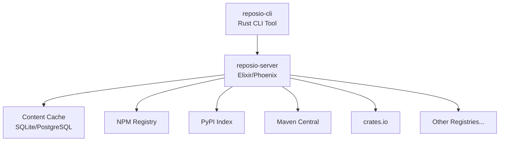

# Reposio

[](https://www.gnu.org/licenses/agpl-3.0)
[](https://github.com/reposio/reposio-cli/actions/workflows/ci.yml)
[](https://github.com/reposio/reposio-server/actions/workflows/ci.yml)

**A modern polyglot package repository system that consolidates package hosting infrastructure through transparent proxying.**

Reposio acts as a single endpoint for diverse package ecosystems while maintaining full compatibility with existing package managers and build tools. No configuration changes needed - just point your package manager to Reposio and it handles the rest.

## 🌟 Features

- **Universal Package Support** - Works with NPM, PyPI, RubyGems, Maven, NuGet, Cargo, Go Modules, and more
- **Transparent Proxying** - No client-side configuration changes required
- **Intelligent Caching** - Content-addressable storage with configurable retention policies
- **Security First** - Integrated vulnerability scanning and audit logging
- **High Availability** - Built on Elixir/OTP for fault tolerance and scalability
- **Enterprise Ready** - LDAP, SAML, and OAuth authentication support

## 🏗️ Architecture



## 📦 Components

### [reposio-server](https://github.com/reposio/reposio-server)
Elixir/Phoenix application providing the core repository proxy and management functionality.

- **License**: AGPL v3
- **Technology**: Elixir, Phoenix LiveView, Ecto
- **Database**: SQLite (default), PostgreSQL, MySQL

### [reposio-cli](https://github.com/reposio/reposio-cli)
Command-line interface for repository configuration and management.

- **License**: MIT
- **Technology**: Rust, clap
- **Platform**: Cross-platform (Linux, macOS, Windows)

## 🚀 Quick Start

### Server Setup
```bash
git clone https://github.com/reposio/reposio-server.git
cd reposio-server
mix deps.get
mix ecto.setup
mix phx.server
```

### CLI Installation
```bash
git clone https://github.com/reposio/reposio-cli.git
cd reposio-cli
cargo build --release
```

### Usage Example
```bash
# Configure your package manager to use Reposio
npm config set registry http://localhost:4000/npm/

# Or use the CLI for advanced configuration
reposio add npm --upstream https://registry.npmjs.org/
reposio list
reposio sync
```

## 🌐 Supported Ecosystems

| Ecosystem | Status | Package Manager | Registry Format |
|-----------|--------|----------------|-----------------|
| **Node.js** | ✅ | npm, yarn, pnpm | npm registry API |
| **Python** | ✅ | pip, poetry | PyPI simple API |
| **Ruby** | ✅ | gem, bundler | RubyGems API |
| **Java** | ✅ | maven, gradle | Maven repository |
| **C#/.NET** | ✅ | nuget, dotnet | NuGet v3 API |
| **Rust** | ✅ | cargo | Cargo registry API |
| **Go** | ✅ | go mod | Go module proxy |
| **PHP** | 🔄 | composer | Packagist API |
| **Dart** | 🔄 | pub | pub.dev API |

✅ Supported &nbsp;&nbsp; 🔄 In Development &nbsp;&nbsp; ⏳ Planned

## 🔧 Configuration

Reposio can be configured through:

- **Environment Variables** - For deployment settings
- **Configuration Files** - For complex routing rules
- **Web Interface** - Phoenix LiveView admin panel
- **CLI Commands** - For scripted management

Example configuration:
```elixir
config :reposio_server, ReposioServer.Repo,
  adapter: Ecto.Adapters.SQLite3,
  database: "reposio.db"

config :reposio_server, ReposioServerWeb.Endpoint,
  http: [ip: {0, 0, 0, 0}, port: 4000]
```

## 🔒 Security

- **Vulnerability Scanning** - Automatic security audits of cached packages
- **Access Control** - Fine-grained permissions and authentication
- **Audit Logging** - Comprehensive activity tracking
- **Supply Chain** - Package integrity verification

## 🏢 Enterprise Features

- **LDAP/Active Directory** - Seamless enterprise authentication
- **SAML 2.0** - Single sign-on integration
- **High Availability** - Multi-node clustering support
- **Monitoring** - Prometheus metrics and health checks
- **Backup & Recovery** - Database and cache backup strategies

## 🤝 Contributing

We welcome contributions! Please see our contributing guidelines in each repository:

- [Server Contributing Guide](https://github.com/reposio/reposio-server/blob/main/CONTRIBUTING.md)
- [CLI Contributing Guide](https://github.com/reposio/reposio-cli/blob/main/CONTRIBUTING.md)

### Development Setup

1. Install dependencies: Elixir 1.18+, Erlang 28+, Rust 1.89+
2. Clone repositories and follow setup instructions
3. Run tests: `mix test` and `cargo test`
4. Submit pull requests with comprehensive tests

## 📄 License

- **reposio-server**: [AGPL v3](https://www.gnu.org/licenses/agpl-3.0)
- **reposio-cli**: [MIT](https://opensource.org/licenses/MIT)

## 💬 Community

- **GitHub Discussions** - Questions and community chat
- **Issues** - Bug reports and feature requests
- **Security** - Responsible disclosure via security@reposio.org

---

**Made with ❤️ by the Reposio team**